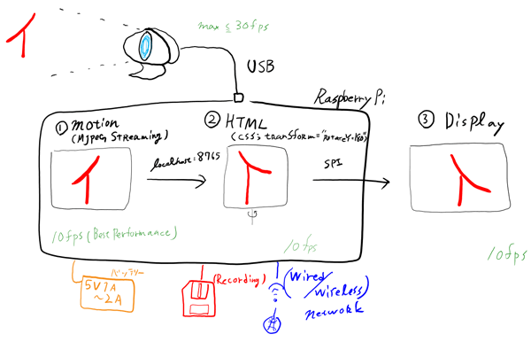

# The Rearview Camera System (RCS) for wheelchair users!

[日本語記事はこちら](index.html)

## What is this?

You can make a hand-maid RCS with this document.
We're aiming to realize products for wheel chair users; Backup camera, Emergency communication tools, and so on.

## Prepare

* Basic consists
 * Raspberry Pi (Raspberry Pi 2 Type B is recommended)
 * USB connected camera (Cheep Webcam is OK, but must be UVC)
 * Display (we use cheap SPI connceted TFT monitor, but you can choose HDMI monitor if you're rich)
 * SD card (16GB+)
 * Power supply / Battery (5V 1A+)
 * Jumper wire
* Options
 * Wi-Fi adaptor (if you need to send a e-mail your situation)
 * USB memory (if you want to record where you go, or who walks along)

## Setup (with pre-installed SD cards)

*Please wait the information of what you should do to start setup without pre-installed SD card. *

1. Link TFT monitor in Raspberry Pi's GPIO (see also: [「ラズパイマガジン2015年春号（第4部, PART1）」(in Japanese)](http://itpro.nikkeibp.co.jp/atcl/mag/14/236763/010900005/)).
2. Insert Pre-installed SD Card (customized Raspbian). 
3. Join your camera to Raspberry Pi's USB ports.
4. Power-on.

Is it works?

## Settings

You can change the property or connect other camera with WEB interface.
Open `localhost:8765` or `"KOBEPI's IP address":8765`.