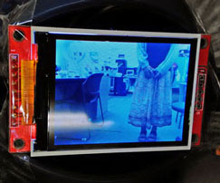
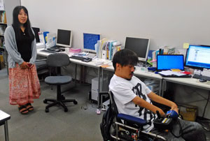

# 電動車椅子のバックモニターを作ろうとしたら、いつの間にかウェアラブルデバイスが出来上がっていた

## 概要：個人で迅速に手作りウェアラブルコンピューター

* 「電動車椅子でも後ろを見たい」という障害当事者の声に2週間で回答
* HTML+JavaScript+CSSにより、短期間で試作品の開発・フィードバックが可能
* 動体検知プログラム (motion) を導入したことで、録画や動体検知をWebベースで実現

## 電動車椅子ユーザーにとってのウェアラブル

日常生活、通勤に旅行など、日々の生活に密着した電動車椅子。街中では後ろの歩行者、自転車にぶつかる恐怖がある。事故を避ける安心のためにバックモニターを作ったが、これは電動車椅子が身体の一部である障害当事者にとってウェアラブルコンピューターのような存在だ。

### とりあえず「後ろを見る」3つの手段を考案

プログラムが簡単（そう）なRaspberry Piに挑戦

 * 自転車用バックミラー　→　車椅子からはみ出て危ない、スタイリッシュではない
 * スマホのカメラ機能　　→　いい角度で映らない、手がふさがって操作できない
 * Raspberry PiでWEBカメラの映像を表示　→　コンパクト、シンプルでわかりやすい、両手もフリー

### 初挑戦ながら、[プロトタイプ](https://ickobe.github.io/RearviewHTML/proto_3.html)は2週間で完成

豊富な資料のあるRaspberry Pi と HTML+JS+CSSの組み合わせ

* カメラ映像は`navigator.getUserMedia()` で取得し、`<video>`に挿入
* 映像の左右反転は`transform: rotateY(180deg);`
* ディスプレイの接続方法は[「ラズパイマガジン2015年春号（第4部, PART1）](http://itpro.nikkeibp.co.jp/atcl/mag/14/236763/010900005/)を参考

getUserMedia()APIは簡単だけど課題が。

* Firefoxの場合、localhostでは毎回「映像を共有」ボタンを押さないといけない
* Chromeの場合、localhostでは機能しない（プライバシー保護？）
* そのほかの軽量ブラウザで対応が進んでいない

### 展示品はIPカメラの技術を応用した改良型

実家・祖父母宅に見守りカメラを作ったことがあり、カメラ映像の配信機能をRaspberry Piに取り込んだ

* カメラ映像は動体検知／ライブカメラプログラムの`motion`にて取得・配信
* どんなブラウザでも動く（展示品では軽量なMidoriを利用）

